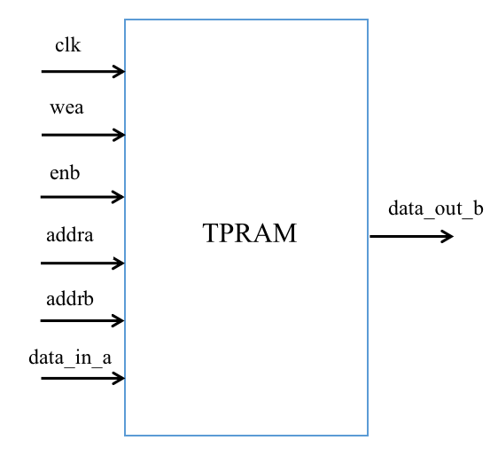
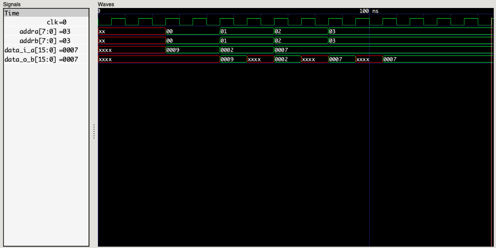
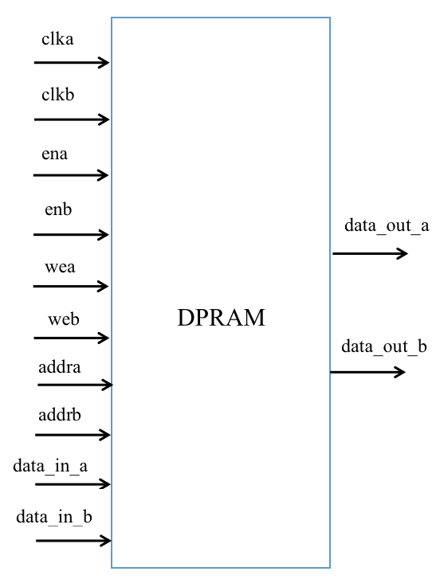
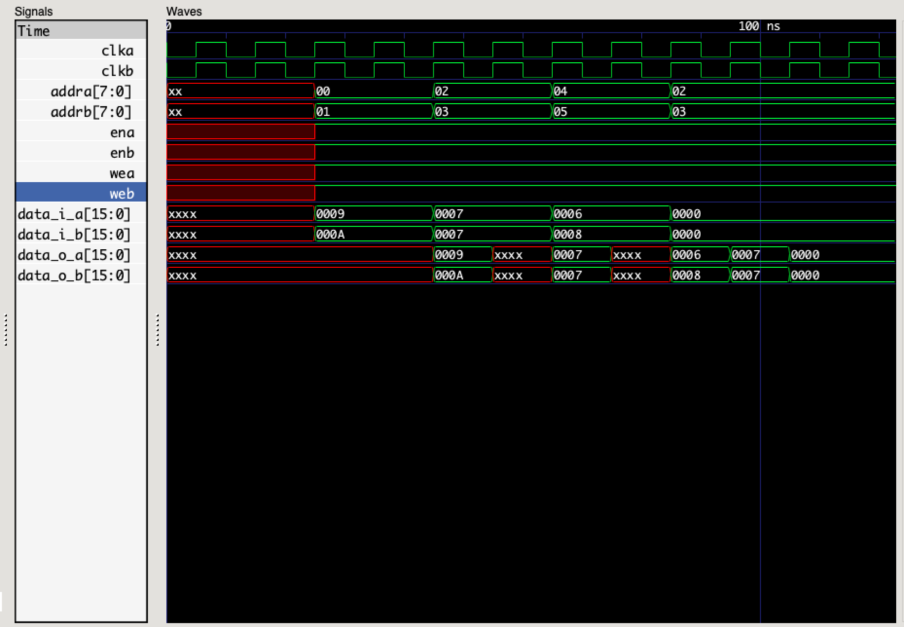

# Dual-Port-RAM
Implementation of dual port ram and test bench file.

#### TPRAM：

The RAM reads and writes are separate. There are two sets of read and write address lines. When reading and writing TPRAM, ensure that the read and write addresses do not conflict. The diagram is as follows：

And wea is the write enable signal of channel a, and enb is the read enable signal of channel b.

A pseudo-dual-port RAM, one channel read, one channel write, the write channel has write data, write address and write enable, read channel has read data, read address and read enable, plus input clock, form the input and output ports.

RAM read and write is described by two procedure statement blocks, one channel read and one channel write. If the clock is asynchronous, that is, read and write are not on the same clock, you can change the sensitive event list of the two procedure blocks. For example, change one to `always@(posedge clkw)` and the other to `always@(posedge clkr)`.

You can test the functionality of the module with a simple `testbench_TPRAM.v` file. Here, additional waveform generation file code is written because the waveform is emulated and viewed on Mac.

The simulation results are as follows:

#### DPRAM:

The RAM is a true dual-port RAM with two sets of read and write addresses. It can perform read and write operations separately. The schematic diagram is as follows:

True dual-port RAM, each channel has six ports: channel enable, input data, output data, data address, write enable, and channel clock, so true dual-port RAM has 12 ports in total.

For a channel of true dual-port RAM, when the channel is enabled, if write is enabled, the value is written to the addra address of RAM and the old value of RAM at the addra address is read. If write is not enabled, the data of RAM at the addra address is read.

You can test the functionality of the module with a simple `testbench_DPRAM.v` file. 

The simulation results are as follows:

The above is all the code implementation, you can run the code, if there is any problem, please raise an issue in time.
